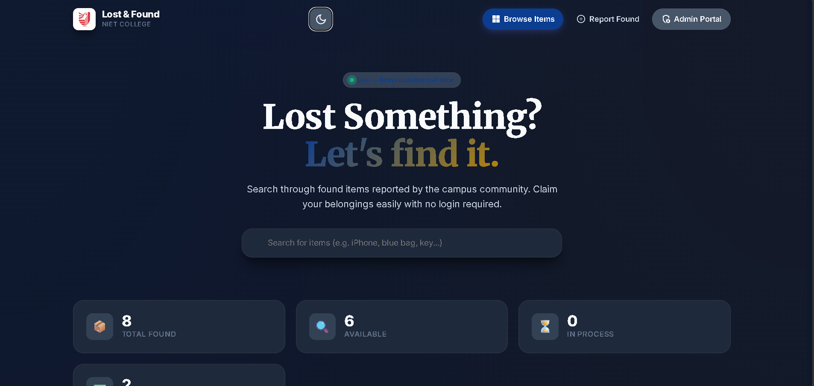

# LostLink — NIET Lost & Found

A simple lost & found system for the NIET campus.

## Problem

No easy campus lost & found system at NIET.

## Features

### Public
- Browse reported items
- Report a lost or found item
- Search and filter results by category, date, and location

### Admin
- Claim management: mark items as claimed and manage ownership
- Dashboard: view open/claimed items and site statistics

## Technical

This project uses Firebase Firestore for data storage. Multi-field filtering in Firestore requires composite indexes; index definitions are included in `firestore.indexes.json`. Deploy indexes with:

## Tech stack

- **Frontend:** HTML, CSS, Vanilla JavaScript (app.js)
- **Database:** Firebase Firestore
- **Hosting / Tools:** Firebase Hosting, Node/npm for dev scripts

## Screenshots



# NIET Lost & Found Portal

A clean, production-ready Lost & Found web portal for NIET College. Built with pure HTML, CSS, and JavaScript, powered by Firebase.

## Features

- **Student Interface** — Browse found items, search/filter, and submit claim requests (no login required)
- **Claim System** — Students fill out ownership proof forms; admin reviews and approves/rejects
- **Admin Dashboard** — Secure login, CRUD operations for items, claims management
- **Responsive Design** — Works seamlessly on desktop, tablet, and mobile
- **Smooth Animations** — Intersection Observer-powered scroll animations, hover effects
- **Toast Notifications** — Real-time feedback for all user actions
- **Spam Protection** — Rate limiting on claims, validation on both client and server (Firestore rules)

---

## Tech Stack

| Layer      | Technology                             |
| ---------- | -------------------------------------- |
| Frontend   | HTML5, CSS3, Vanilla JavaScript (ES6+) |
| Backend    | Firebase (Firestore, Storage, Auth)    |
| Hosting    | Firebase Hosting                       |
| Animations | CSS + Intersection Observer            |

---

## Project Structure

```
├── index.html          # Homepage — browse all items
├── item.html           # Item detail + claim form
├── admin.html          # Admin dashboard (login required)
├── css/
│   └── styles.css      # Complete design system
├── js/
│   ├── firebase.js     # Firebase init + DB/Storage/Auth helpers + Toasts
│   ├── app.js          # Student-facing logic (browse, search, filter)
│   └── admin.js        # Admin dashboard logic (CRUD, claims)
├── assets/             # Static assets (if needed)
├── firebase.json       # Firebase Hosting config
├── firestore.rules     # Firestore security rules
├── storage.rules       # Storage security rules
├── seed-data.js        # Sample data seeder script
└── README.md           # This file
```

---


## Seed Sample Data

1. Open the app and go to `admin.html`
2. Log in with your admin credentials
3. Open browser DevTools (F12) → Console tab
4. Copy and paste the contents of `seed-data.js`
5. Press Enter
6. Refresh the page

---

## Firestore Data Structure

### `items` collection

```
{
  title: "Blue JBL Earbuds",
  description: "Found near charging station...",
  category: "Electronics",
  location_found: "Library",
  date_found: "2026-04-20",
  image_url: "https://...",
  status: "available" | "claimed" | "returned",
  uploaded_by: "admin@niet.co.in",
  created_at: Timestamp,
  updated_at: Timestamp
}
```

### `claims` collection

```
{
  item_id: "abc123",
  student_name: "Rahul Kumar",
  student_email: "rahul@niet.co.in",
  student_phone: "9876543210",
  proof_description: "It's my blue earbuds with...",
  proof_image: "https://..." | null,
  status: "pending" | "approved" | "rejected",
  created_at: Timestamp,
  resolved_at: Timestamp
}
```

---

## Security Features

- ✅ Admin-only authentication (email/password)
- ✅ Firestore rules enforce read/write permissions
- ✅ Storage rules restrict file types and sizes (max 5MB, images only)
- ✅ Client-side form validation
- ✅ Server-side validation via Firestore security rules
- ✅ Rate limiting on claim submissions (max 3 per 5 minutes per email)
- ✅ HTML escaping to prevent XSS
- ✅ Image compression for large uploads

---

## Browser Support

- Chrome 90+
- Firefox 88+
- Safari 14+
- Edge 90+

---

## License

Built for NIET College internal use.
